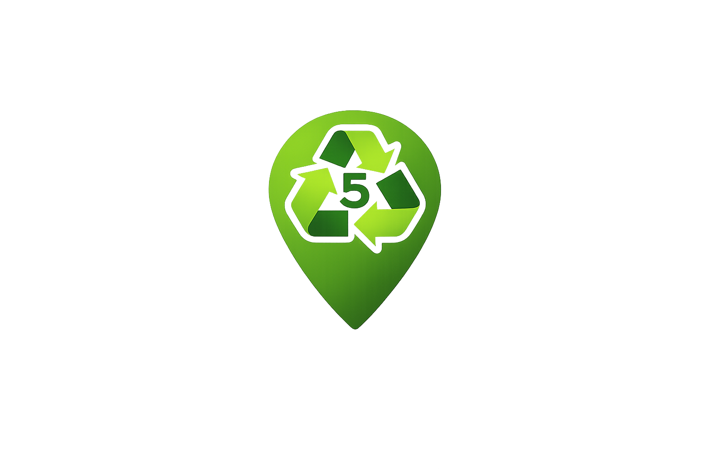

## More Than Just a Bin?
Recycling bins to most people are like road trips, you only see the final result of a corresponding action which in that case would be successfully travelling from Point A to Point B; in the recycling case, successfully placing a recyclable item in the corresponding bin. In other words, the system behind both processes are overlooked. Obviously someone is responsible for deciding where the bin is located, its labeling, the accepted material types, and how interactable it poses itself to be. A great recycling system is not about encompassing a vast area, rather it is about providing a clear structure that is easily understood and reused. That being said, this is a good way to think about design patterns in software engineering. A design pattern is essentially a reusable blueprint to solve commonly occuring problems. Similarly to how a recycling guide advises people about proper disposal of certain items, a design pattern provides developers with a method to organize their code.

## Labeled Bins Translates to Labeled Components
I noticed the relativeness of design patterns while working on my group's ICS 314 final project called [*Cycle5ense*](https://cycle5ense.vercel.app/). Without getting into too much detail, we generally had to establish a set of pages redirectable within the site. Initially, these pages can all be seen as separate or distinct, however, this case is clearly the opposite when looking at it from a coding perspective. The website as a whole needed to fit into a single consistent system; that is to say, the site needed to share a layout, a theme, components, and sense of redirection. This is exactly where design patterns exhibit themselves in plain sight.

One pattern that appeared clearly in our project so far has been a mix of structural and behavioral patterns; specifically component pattern. In React and Nextjs, the interface is built from components instead of writing everything into a single giant page. We can simply imagine this as having labels on recycling bins to direct recyclable traffic in a way that eliminates the concept of having to make someone sort a single unorganized bin. With our project in particular, our project splits up pieces of entire pages. One of our components we can consider is the footer. The footer is a reusable part of the site that offers social links, navigation, and a consistent info section across the entire application.

## Campus Map of the Website
Another pattern that is apparent in our project is strictly a structural design pattern; specifically layout pattern. The root layout wraps the application with a shared structure and this reminds me of the UH Manoa campus itself. Individual buildings can be different but, they still belong to the same campus with the same roads, signs, and general structure. In our website, each page can have its own content yet, the layout keeps the experience connected as it gets rid of the feeling of jumping between unrelated websites whenever one clicks on a new page.

## Different Users, Different Signs
A third pattern I noticed in our project is strictly a behavioral design pattern; specifically a role-based behavior. The site does not show the exact same navigation options to every visitor. A regular user, an admin, and someone who is not signed in may need different links. Instead of building three completely separate websites, the layout chooses which navigation items to include based on the user’s session and role. This is like having different recycling instructions depending on the item's material. The bin is still a part of the system and the action changes based on what material is being handled.

## Patterns Are Not Just Tendencies
Working on Cycle5ense made me realize that design patterns are not only about memorizing names for interviews but, they are also about recognizing good structure while building something real. Before this project, I thought of patterns as something advanced or theoretical. After spending some time working on the project, I see them more as habits that prevent a project from becoming messy. Components help separate responsibilities, layouts keep the site consistent, and role-based logic keeps different user experiences organized. 

Funnily enough, a recycling analogy works well with explaining software systems as both are prone to failure when unorganized. If bins are unable to direct recyclable traffic, there becomes a lack of trust in the system. Coding is exactly like that; if every page is built differently, repeated code is copied everywhere, and logic is scattered, developers can be hesitant to make changes. Design patterns are the labels, bins, and campus map that keep the system understandable.

## Cleanin' Up More Than Bottles
Cycle5ense is a student project but, it demonstrates the very reason why design patterns matter. Our website is not just a collection of pages, it's a system made of reusable pieces, shared structure, and organized behavior. In the same sense that Cycle5ense tries to make recycling clearer for users, design patterns make code clearer for developers. The patterns do not solve every problem by themselves, however, they do put us in a smarter position to start.