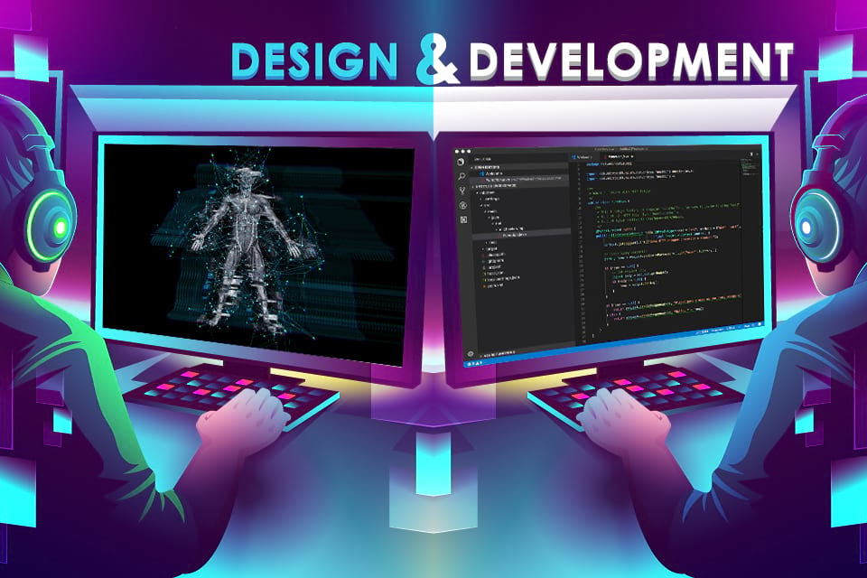

Goal:
Third, create a technical essay (approximately 3-4 paragraphs) that discusses your interests in software engineering and what kinds of skills and experiences you hope to develop in future.

## My Developed Interest in Software Engineering
Software engineering piques my interest for the sole reason that it presents itself as the intermediate of problem-solving and creating things that people can interact with. I would be a liar if I did not mention that video games play a major reason I developed an interest in the first place. I grew up playing tons of video games and these experiences were responsible for the time I noticed how codes created an entire enjoyable memoir for me. Even before understanding how codes fused visuals, sounds, physics, rules, and user choices, I was curious about what happened behind the screen. This curiosity drove the motive for wanting to create a system of my own; with experience in a object oriented programming course, I was exposed to the idea that game development programming was more like designing a whole other world with logics rather than abstract math.

As I continued to learn more about game development, I started to appreciate software engineering as more than something which works once; rather I appreciate it to be more like having this system be reliable and maintainable over periods at a time. To me, the idea of being able to design a system that continuously develops feels challenging yet satisfying. That long-term mindset of being able to add features without everything breaking is imperative to what keeps me interested in this field; software engineering to me is not only just being able to solve a problem but, being able to solve in a way that is clean, concise, and understandable.

## Skills and Experiences I Hope to Develop in the Future
Over time, I want to strengthen my fundamentals that apply to general software engineering. This includes, but not limited to, writing clean code, designing easily extendable systems, as well as improving comprehension in data structures, algorithms, and performance. With video games, they make users respect efficiency in aspects like frame rate or memory usage; I plan to make it a goal in becoming confident analyzing both time and space complexities in systems to ensure practical optimizations. Moreover, I want to familiarize myself with more real-world development practices like pair programming and writing my own code documentation that explains to others what I built, how so, and eventually how to use it. Ultimately, I want to combine what inspires me from video games with strong general software engineering principles to build fun projects that are easy to use and solid mechanically.
