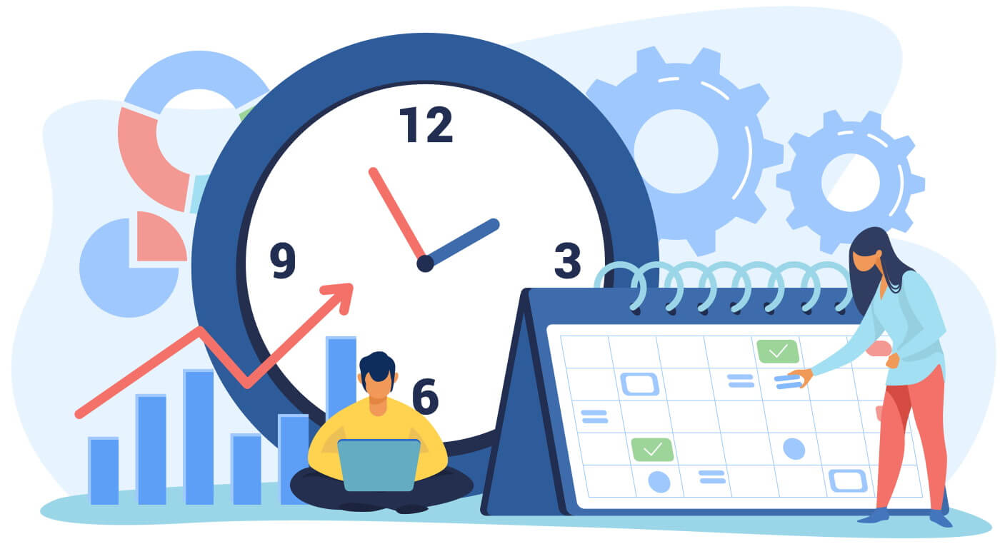

  

## Learning to Estimate Before Coding
I realized that effort estimation is more than merely predicting the time a code will require; it involves thoroughly considering the entire problem beforehand: which files could be impacted, which sections of the application require testing, if the task includes UI alterations, database modifications, authentication, deployment, or interactions with colleagues. Initially, my approximations relied primarily on how challenging the problem appeared from the title. If an issue looked like a small visual change, I assumed it would take a short amount of time. If it involved the database, map feature, or role-based behavior, I expected it to take longer. For example, issues related to my team's ICS 314 final project Cycle5ense, the UI such as footer improvements or landing page adjustments seemed easier to estimate since they were mostly contained in one component or page. On the other hand, issues involving the map fallback, recycling date display, or admin redirection were a bit more challenging as they touched multiple parts of the project. For those issues, my estimate was based on past experience from ICS 314 WODs, especially those that used Next.js, React-Bootstrap, Prisma, and NextAuth. I also used my experience from earlier assignments where small UI or routing changes were usually faster, while database and deployment-related fixes often took longer than expected.

## What Estimating Meant Even If I Was Completely Wrong
Although my predictions were not always precise, creating them beforehand proved to be beneficial. The estimate made me stop and reflect on the problem rather than diving immediately into the code. This allowed me to determine what the task could entail and if I should seek clarification before starting on it. It enhanced the GitHub project board's utility since issues were not merely cataloged as tasks; they carried an aspect of size and priority.

An instance from our Cycle5ense project was the problem with the recycling date input being incorrect. Initially, it seemed like an easy formatting issue but, it emphasized the consideration of time zones, the method of date storage, and the way it was displayed to the user. Since our project is located in Hawaiʻi, accurately displaying dates in HST was important. A minor label adjustment such as “Date (HST)” was straightforward yet the real challenge involved figuring out where the time conversion occurred and if the issue lay in the frontend display, the database value, or both. This demonstrated that early estimation is beneficial, even if the estimate is inaccurate, as it uncovers hidden complexities.

## Tracking Actual Effort Makes Work Realistic
Monitoring actual effort proved beneficial as it provided me with a clearer understanding of the true duration of tasks in relation to my initial time estimates. Without tracking, I likely would have recalled many issues as requiring less time than they truly did. In truth, programming was merely one aspect of the job. A considerable amount of time was dedicated to analyzing current files, evaluating teammates' code, testing modifications locally, resolving errors, investigating GitHub issues, and confirming the changes matched the overall project objectives.

For instance, enhancing the footer may appear to be solely a coding job, yet it also involved reviewing the current design, ensuring the spacing appeared correct, and determining if the alteration aligned with the overall Cycle5ense color scheme. Similarly, an admin redirection issue required more than writing a link. It involved understanding the app’s routing structure, the admin page, and whether the change matched the expected user flow. Tracking effort made these extra steps visible instead of treating them as background work.

## How I Tracked Coding and Non-Coding Effort
To monitor my actual effort, I primarily employed a manual method by recording the time dedicated to particular tasks. I distinguished coding tasks from non-coding tasks according to my activities at that moment. The programming task required altering files, resolving problems, testing the software, improving elements, and adding updates to the code repository. The non-coding tasks included reviewing issue descriptions, researching or strategizing, conversing with team members, assessing requirements, and analyzing the project layout before implementing changes.

I believe my tracking was reasonably accurate though not perfect. It was easier to track coding time because, I was actively working in VSCode or testing the app. Non-coding time was harder as it often happened in smaller pieces, such as reading a GitHub issue, checking feedback, or thinking through a bug before actually coding. Next time, I would want to record start and stop times for non-coding effort more consistently instead of accounting for the time doing some non-coding effort as a whole; I think doing this would better specify what was exactly being done for durations aside from coding.

## How Tracking Influenced Future Estimates
Tracking actual effort helped me realize that future estimates should include time for setup, testing, and review, not just implementation. Before this project, I might estimate a task based only on the code change itself. After working on Cycle5ense, I realized that a “small” issue still needs time for finding the right file, understanding the existing component, making the change, running the app, checking the result in the browser, and possibly fixing side effects. This altered my perspective on subsequent matters. For instance, if a task included Prisma, seeded data, or deployment behavior, I would anticipate requiring additional time, as those factors frequently lead to more opportunities for unforeseen problems. For styling tasks, I would continue to allocate additional time for visual inspections, since a component might appear accurate in the code but not present the desired layout when rendered. Noticing my actual effort enhanced my estimations by showing that software development comprises both apparent and concealed tasks.

## AI Assistance and Manual Verification
I used AI tools as support during the project, mostly for reasoning through bugs, improving explanations, and checking possible approaches. When AI was used for coding-related tasks, the time still counted as effort because, I had to write prompts, review the response, decide what was useful, and manually adapt the suggestion to our actual Cycle5ense codebase. 

An example of an AI prompt I used is: “Here is our Next.js page together with the database operation.” The recycling date shows an inaccurate time for individuals in Hawaiʻi. "Can you explain to me what can be causing the timezone issue?" For a request of this kind, I would spend some time formulating the prompt, take a short moment for the response, and then allocate further time evaluating the suggestion by comparing it to our actual documents. I didn't accept AI responses as is since the recommendations frequently required adjustments to fit our project's structure, professor expectations, Bootstrap design tastes, or predefined coding guidelines. For future tracking, I would separate AI-related effort more clearly. For example, I would track prompt writing, reading the response, testing the suggestion, and editing the final code as separate pieces of effort. This would make the data more accurate and would also show how AI helps with productivity without pretending that AI removes the need for human judgment.

## What I'd Try Next Time
In the future, I will improve my assessment method by breaking down each problem into smaller parts before making estimates. Rather than giving one estimate for the whole task, I could incorporate planning, testing, and review time. This would improve the estimate's precision as many issues aren't difficult due to one major component; instead, they are complicated due to many small tasks that add up. I would pay closer attention to non-coding efforts as well. Non-coding tasks were among the simplest to undervalue, as they didn't always seem like “actual work,” despite their significance. Examining requirements, considering teammate input, strategizing the design, and assessing the project board all played a key role in the project's success. For an upcoming project, I would utilize a spreadsheet, timer, or provide comments more regularly to ensure the final effort report relies on more accurate data.

## Final Thoughts
Overall, effort estimation gave me practical insights into managing software projects. Cycle5ense showed that estimation isn't solely about achieving complete accuracy; rather it calls for genuine planning, monitoring, and extracting insights from the discrepancy between the prediction and the actual result. The key insight I obtained is that simple issues can become intricate when they interact with the larger system. A small UI change, date fix, or redirect could necessitate design decisions, testing, and teamwork among members. Consequently, estimating effort is vital not just for planning but also for understanding the true amount of work required in software development.