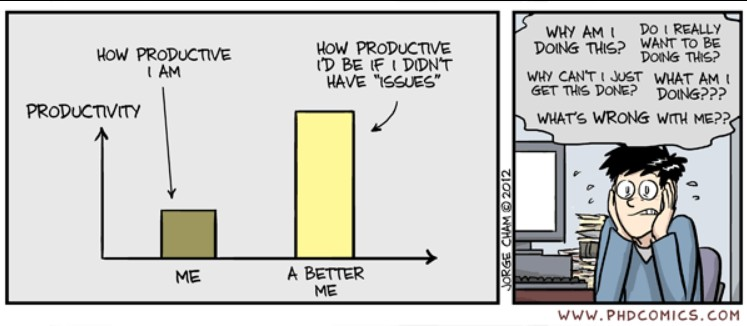

Write a technical essay that discusses why smart questions are important for smart software engineers, how the chosen questions fulfill (or not) the precepts for smart questions, how the responses reflect the smartness (or lack thereof), and the insights you gained as a result of this experience.

Be sure that your essay includes a textual summary of both the “smart” and “not so smart” questions, as well as a link to the StackOverFlow pages where they are located. Don’t just put the URL to the questions and force the reader to visit StackOverFlow to read the question there, then switch back to your essay to continue. Your essay should contain enough detail about the two questions so that the reader doesn’t need to visit StackOverFlow to make sense of your essay.

## Why "SMART" Questions Are Enforced
As I get older, I become increasingly exposed to this idea of "*asking better formulated questions*" which sounds like a social expectation. Regardless, this expectation is really an engineering efficient rule; a prime example is its usage on websites such as StackOverflow. Various communities enforce this "SMART" question approach because, answering questions come with a cost similar to formulating questions to begin with. Answering questions requires an individual's time, attention, and cognitive load. A vague question will always force helpers to reverse-engineer missing context before they can even begin diagnosing; this is wasted effort and it scales poorly when numerous people do it frequently.

In Eric Raymond's *How To Ask Questions The Smart Way*, he frames SMART questions as being able to respect the time of those who could help you. A "smart" question isn't just polite, rather it is also convenient for the helper. When the quality of the question is high, the community can produce answers that are efficient and effective. This is to say that communication requires less back-and-forth relay along with responses actually being helpful. In the perspective of StackOverflow, it represents the guidance of recreating a minimal reproducible example to reinforce the same idea shared by Eric Raymond; which is to reduce guesswork and make the issues testable. When standards like this are enforced, StackOverflow becomes a searchable knowledge base instead of a pile of barely explained problems that will never be solved.

## What Asking "SMART" Questions Are Like
In practice, asking a "SMART" question looks more like writing a concise report rather than typing and sending that "help pls" text to your friend about homework that is due in an hour. The core elements of this approach is consistent across languages and topics: they start with a clear one-sentence goal stating what is trying to be accomplished; they narrow down one specific failure explaining what it is and where; and they include evidence of error text or incorrect output followed by expected or actual behavior. This contrast in approach transforms the simple saying "it doesn't work" to something measurable.

Moreover, a smart question shows effort without becoming a journal entry that everyone comments "TL;DR" to. A smart approach briefly mentions what attempts were made that did not solve the issue so that helpers are prevented from repeating the same dead ends. To add, the snippet of the issue is scoped which provides enough information to reproduce the said issue without projecting an entire project dump. This why minimal reproducible examples are valued; people can run, reason, and verify issues quickly which in turn leads to confident solutions.

## Case Study of a SMART Apporach
@to-do

## Case Study of a not so SMART Approach
@to-do

## Creating Prompts Moving Forward
@to-do
