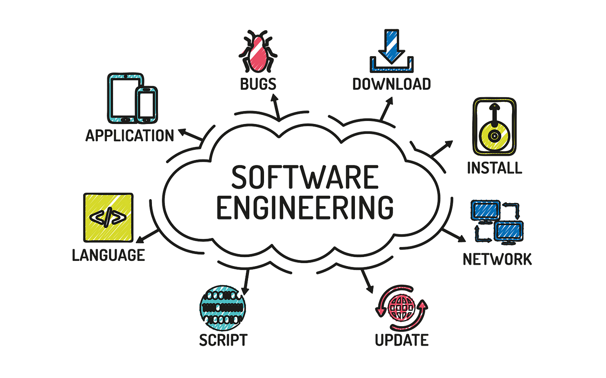

  

## The Move from Learning to Practicing
At the start of the semester I wrote another technical essay called [*Developing a Successful Software Engineering Experience*](https://jslagazo.github.io/essays/developing-successful-see.html), I mentioned that software engineering captivated me since it combines problem-solving with the creation of interactive products for people. I tied that interest to video games since they were among the first instances that helped me realize how coding could generate a complete experience beyond the display. During that period, I viewed software engineering as beyond simply getting something to function one time. I saw it as developing a system that could stay reliable, sustainable, and understandable throughout the years. After completing ICS 314, I still maintain that original viewpoint, however, I now understand it in a more practical way. In the past, ideas like clean code, maintainability, documentation, and extensible systems appeared to be goals I sought to improve. In the final project, those concepts transformed into actual duties. The Cycle5ense project revealed to me that software engineering encompasses much more than just coding for a website. It involves overseeing a project, collaborating with a team, managing modifications, making design choices, and considering how actual users will engage with the system. In that regard, ICS 314 helped transform my initial interest in software engineering into a more defined comprehension of what the discipline truly demands. The course focused on web development as its primary platform yet, the broader lessons extend beyond web applications. Three subjects that caught my attention the most were Agile Project Management, Configuration Management, and Ethics in Software Engineering.

## Agile Project Management: Turning Ideas into Organized Progress
At the beginning of the semester, I noted my desire to acquire more experience with practical development methods such as pair programming and documentation. The concluding project made me realize that effective software development relies significantly on project management. A great idea alone isn't sufficient if the team lacks a clear method to arrange the tasks. Agile Project Management was crucial as it provided our team a method to divide a large project into smaller, more manageable activities. Rather than viewing Cycle5ense as a single large task, we focused on individual features, bug fixes, and enhancements. This encompassed activities such as constructing pages, enhancing the footer, developing admin-related features, utilizing map functionalities, managing database-linked data, and resolving user interface problems. Every one of these elements played a role in the final outcome but, dividing them into distinct issues simplified the project and facilitated its completion. Issue Driven Project Management proved to be particularly beneficial as it rendered the work transparent. When a task was created as a GitHub issue, it became simpler to assign accountability, monitor progress, and comprehend what remained to be completed. This facilitated the link between the coding aspect of the project and the collaborative aspect of the project. It aligned with one of my earlier goals for the semester: gaining experience in a more authentic software development setting. This lesson is relevant beyond just web application development. In a design project involving engineering, a robotics initiative, or perhaps a renewable energy system, one could apply the same approach. A significant issue can be broken down into smaller activities like research, design, testing, documentation, and presentation. Agile Project Management is beneficial as it provides a framework for creativity. It aids in transforming a wide concept into consistent advancement.

## Configuration Management: Making Software Reliable Over Time
In my initial essay, I mentioned that one reason I was drawn to software engineering was the difficulty of creating systems that can evolve continually without everything collapsing. Configuration Management is closely related to that concept. It is a method that enables a project to expand while still staying structured and operational. In the final project, I discovered that software can fail due to factors not always within the core code logic. A page component can be correctly coded, yet the project may still fail due to an incorrect database URL, an improperly generated Prisma client, mismatched dependencies, or absent environment variables. This demonstrated to me that reliability goes beyond just clean code. It also relies on overseeing the complete development environment. Resources such as GitHub, Prisma, PostgreSQL, Vercel, and configuration files clarified this lesson. Our project required more than functional TypeScript and React components. It required uniform setup for both local development and deployment. If every team member had a distinct configuration, then something that functioned on one computer could malfunction on another. Configuration Management contributed to increased stability, repeatability, and simplified maintenance for the team on the project. This relates directly to my previous interest in systems that are dependable and sustainable over time. At the beginning of the semester, I grasped that concept in a broader sense. I recognize that maintainability relies on effective practices: utilizing version control properly, organizing dependencies, documenting installation processes, and ensuring the deployed version aligns with the development version. This principle is relevant beyond just web development. In a hardware simulation, embedded system, or engineering analysis project, setting up correctly is still important. If a teammate employs varying software versions, test files, or parameters, the outcomes may not align. A project holds value solely when it can be replicated and comprehended by others. Configuration management is a practice that makes this possible.

## Ethics in Software Engineering: Remembering the People Behind the System
A further takeaway from ICS 314 is that software engineering encompasses more than just technical aspects. It also includes a sense of ethical responsibility. At the start of the semester, I concentrated on designing systems for people to engage with and appreciate. Following my work on Cycle5ense, I began to reflect more on the accountability associated with creating something for actual users. Cycle5ense was developed with a focus on recycling and sustainability, creating a link to an actual global concern. Although it was a project for class, it still brought up ethical issues. When users depend on a map or table to locate recycling sites, the details must be precise and easy to understand. If admin users are able to handle crucial data, then access must be appropriately regulated. If the initiative promotes eco-friendly actions, then the design must assist users rather than perplexing them. Ethics in software engineering involves considering the impact of software on people, rather than solely focusing on its technical functionality. A feature can operate effectively yet be designed poorly if it confuses users, reveals information indiscreetly, or causes unnecessary misunderstandings. This is even more significant in systems associated with health, transportation, education, finance, or public infrastructure. In such instances, minor software choices can lead to significant repercussions. This relates to my initial interest in developing interactive systems. Initially, my thoughts were primarily focused on the thrill of creating something for users to enjoy. I now realize that user engagement also entails responsibility. If individuals are going to utilize something I create, I must take into account clarity, trust, accessibility, privacy, and potential misuse. Effective software engineering goes beyond merely creating something remarkable. It involves creating something accountable.

## The Bigger Lesson
Reflecting on my initial essay, I realize that my early grasp of software engineering wasn't incorrect rather insufficient. I have always prioritized clean code, dependability, ease of maintenance, and user engagement. ICS 314 provided me with insights into the methods that enable those qualities. Agile Project Management showed me how teams arrange their work and break down large objectives into achievable tasks. Configuration Management showed me that dependable software relies on uniform tools, environments, dependencies, and deployment configurations. Ethics in Software Engineering informed me that creating software involves considering the individuals impacted by the system. The most important lesson I learned is that software engineering involves much more than just the end result. It concerns the procedure that underpins the product. A functional website is essential but, the technology that supports it is equally important. The project must be clear, sustainable, structured, and accountable. At the beginning of the semester, I mentioned my desire to create enjoyable projects that are user-friendly and structurally sound. Following ICS 314, I still desire that but, I have a clearer insight into what is required to achieve it. A robust software system is not built solely through code. It is developed through strategy, collaboration, setup, examination, records, and responsible design. That distinguishes merely creating a program from designing a system.