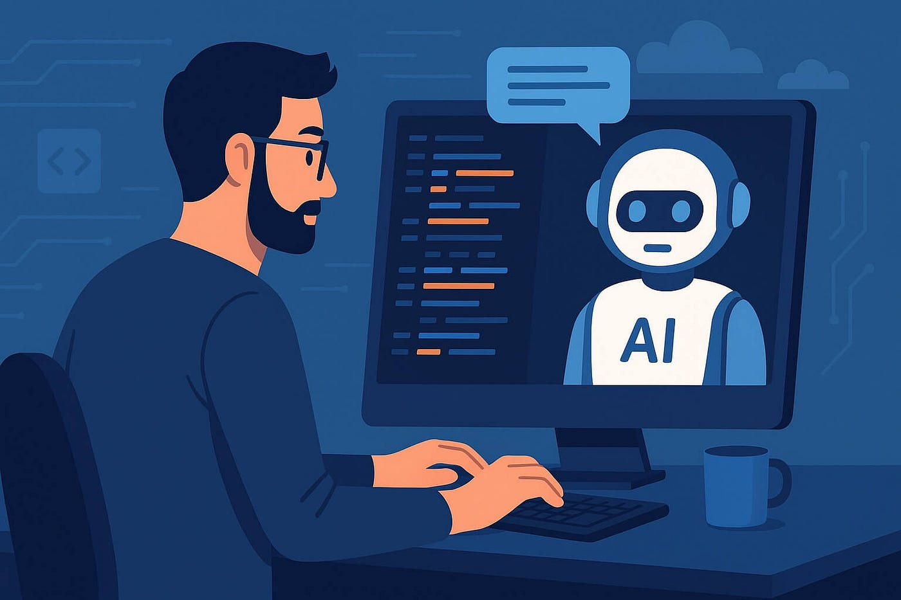

  

## I. Introduction
Artificial intelligence has certainly become a crucial component of education today. Students have increased resources to pose questions, experimenting with concepts, and obtaining responses beyond the classroom. This holds significance in software engineering since it frequently entails troubleshooting, debugging, and acquiring knowledge. AI helps in identifying errors, suggesting practices, simplifying ambiguity, and providing instances that make ideas easier to understand. Throughout my experience in ICS 314, I mainly employed ChatGPT to enhance my comprehension and finish my tasks. I saw it not as a simple replacement for doing the task myself rather as a partner to evaluate and guide my work. I employed ChatGPT to understand my assignments, review my code, generate design ideas, and explain errors. In general, AI was useful when I had a definite vision of my objectives, however, it fell short when I expected it to provide a perfect response for me without careful validation.

## II. Personal Experience with AI

1. **Experience WODs:**
For Experience WODs, I primarily used AI when I encountered setup problems or required assistance in comprehending the assignment’s requirements. An instance occurred during the use of the Next.js application template. A prompt I utilized was something along the lines of, “I am developing an ICS 314 Next.js WOD and encountered this Prisma error, what does it signify and how can I resolve it?” AI proved helpful as it allowed me to dissect intimidating error messages into manageable components. Nonetheless, the drawback was that occasionally the initial response provided an excessive number of potential solutions, requiring me to still evaluate the recommendations against the actual course guidelines.

2. **In-class Practice WODs:**
For in-class practice WODs, I utilized AI less as a code creator and more as a rapid explanation resource. For instance, I could inquire, “Why isn’t my React-Bootstrap layout aligning as I anticipated?” or “What distinguishes Container from Container fluid in React-Bootstrap?” This allowed me to grasp the layout tools more quickly. The advantage was that I could swiftly fix minor miscommunications. The disadvantage was that if I depended on AI excessively during training, I might not develop the same pace needed for the actual timed WODs.

3. **In-class WODs:**
During actual in-class WODs, I tried not to depend heavily on AI because, the point of the WOD is to show that I can complete the task legitimately under time pressure. If I did use AI, it was usually after the WOD to understand what went wrong. A prompt might be, “Here is my code from the WOD. Why was my navbar spacing wrong?” This was helpful for reflection but, not something I wanted to rely on during the timed part. AI helped most after the fact because, I could learn from my mistakes without interfering with the purpose of the assignment.

4. **Essays:**
I hardly utilized AI in my technical essays I wrote. I understand some may use it to generate titles, develop subtitles, arrange paragraphs, and enhance the flow of their writing while maintaining personal style. For instance, I posed prompts such as, “Provide me with imaginative title suggestions for a technical essay concerning design patterns,” or “Could you rephrase this paragraph to appear more natural while still sounding like me?” The advantage was that AI could assist overcoming the blank-page issue, however, the price was that the essay can become overly generic and miss the entire focus of being relatable. If anything, I did use AI to double check any redundancy and grammatical mistake albeit I never ask AI to write an essay for me as I am opposed to the insincerity it establishes to the writer.

5. **Final project:**
In the final project, AI proved to be one of the most valuable resources. Our initiative, Cycle5ense, entailed creating a web application centered on recycling utilizing the Next.js application framework. I utilized AI for generating landing page concepts, addressing admin sign-in layout inquiries, footer spacing issues, resolving database connection problems, and clarifying the roles of Vercel, Prisma, Neon/PostgreSQL, and pgAdmin in conjunction. Illustrative prompts featured, “Could you assist me in creating a landing page with React-Bootstrap without exceeding the specifications?” and “If I push this code, will the remote database display the pins?” AI assisted me in linking the technical components. Nevertheless, I needed to test everything both locally and in the deployed environment since AI couldn't fully understand my project's status without the necessary code or screenshots.

6. **Learning a concept / tutorial:**
AI assisted me in understanding ideas from tutorials by breaking them down into easier language. For instance, while using Next.js, Prisma, Playwright, or ESLint, I might ask, “Clarify this as if I am still mastering the template,” or “What is the function of this file in the project?” This simplified tutorials since AI could convert formal documentation into detailed, step-by-step guides. The disadvantage is that AI can occasionally simplify matters too much so I had to still contrast its explanation with the course content.

7. **Answering a question in class or in Discord:**
I did not use AI to directly answer questions in class or Discord very often but, I did use it to check whether my understanding was correct before saying something. A prompt could be, “Is this explanation of why the database table is not showing in pgAdmin correct?” AI helped me avoid giving a confusing answer. The cost is that using AI for public answers requires extra caution because, if the AI is wrong I could easily spread incorrect information.

8. **Asking or answering a smart-question:**
AI assisted in enhancing how I posed technical inquiries. Rather than asking something vague like “Why isn't my project functioning?”, I used AI to assist me in identifying the problem further. For instance, I could inquired “Considering this error message, what information should I provide when sharing my situation to attract assistance?” This enabled me to pose more intelligent questions since I began to incorporate the command I executed, the error message, the associated file, and what I had already attempted. This was one of the more effective applications of AI as it enhanced my communication rather than merely providing me with an answer.

9. **Coding example e.g. “give an example of using Underscore .pluck”:**
AI proved helpful for coding examples when I needed a quick demonstration of using a tool or method. I could ask AI to “Show me an example using this function in TypeScript.” It could provide me with a template that I could adjust to fit my needs, however, the downside is that the example code is often excessively refined or too broad. That being said, making adjustments to better align it with the assignment requirements or my team's project structure often took some time.

10. **Explaining code:**
AI also proved to be quite effective in clarifying code, particularly within extensive template files. Sometimes the Next.js application template contained files that interacted in ways that weren’t clear to me so, a prompt I used was "Could you clarify the purpose of this file and how it links to the overall project structure?" This allowed me to grasp the connections among components, pages, seed files, Prisma schema, and tests. The advantage was that I could grasp the structure more quickly. The price was that I needed to give sufficient context; otherwise, the explanation might remain too broad.

11. **Writing code:**
I used AI to help write code though I learned that AI-generated code should not be trusted immediately. For example, I asked for help writing React-Bootstrap page sections, test files, and small UI components. A prompt might be, “Using React-Bootstrap, help me make four feature boxes for our landing page.” This was useful as it gave me a working structure, however, AI sometimes added too many divs, used unnecessary complexity, or wrote code that did not match the style of the course template. I often had to ask follow-up prompts like, “Can we simplify this and use the imported React-Bootstrap components instead?”

12. **Documenting code:**
AI helped with documenting code because, it could turn rough notes into clearer comments. For example, I might ask, “Add short beginner-friendly comments to this function explaining what each part does.” This helped me write comments that were easier to understand without being too long. The benefit was improved readability. The downside was that AI sometimes over-commented obvious lines, so I had to remove comments that felt unnecessary.

13. **Quality assurance:**
For me, quality assurance represented one of the most robust applications of AI. I utilized it to comprehend ESLint errors, Prisma migration problems, Playwright test malfunctions, and layout glitches. Example prompts included, “What is the meaning of this ESLint error?” "Why does Playwright indicate that the saved session has expired?" and "What issues exist with this Prisma setup?" AI assisted me in pinpointing probable causes and provided a verification checklist. The downside of this was that debugging still needed actual testing. AI might propose options yet I needed to execute the commands, examine the files, and verify the solution.

14. **Other uses in ICS 314 not listed:**
Apart from coding, I utilized AI for helping me set up my portfolio, critique my reflections, document work, and recap presentation advancements. For instance, I requested assistance in summarizing which files were modified during a project. This allowed me to express my work with greater clarity. The primary constraint was that AI often rendered writing too refined or conventional, requiring me to edit it to reflect my voice and personal experience.

## III. Impact on Learning and Understanding
AI enhanced my learning by providing feedback whenever I encountered difficulties. Rather than fixating on issues for an extended period, I could inquire about their meaning and then verify the explanation via debugging. This enabled me to understand tools like Next.js, Prisma, React-Bootstrap, and Playwright more effectively. Albeit, AI also impaired my learning by promoting the rapid acceptance of a response. I observed that the best approach to utilizing AI is to refrain from simply copying and pasting without thought. It is crucial to explore the motivations behind how something functions by asking additional questions and contrasting the responses with one's own coding. As a result, AI assisted me in improving my problem-solving abilities.

## IV. Practical Applications
AI was also useful outside of individual ICS 314 assignments since it supported real project collaboration. In our final project, AI helped me think through user interface layout, database behavior, deployment issues, and documentation. These are practical software engineering tasks because, real projects require more than just writing code. They also require communication, debugging, testing, and design decisions. For example, when working on Cycle5ense, AI helped me understand how local development and remote deployment connect. AI challenged me to think about how a user might interact with a landing page, footer, admin login area, and recycling statistics page. Essentially, the AI posed assistance to real-world software engineering by speeding up idea generation though it still needs human judgment to identify what genuinely fits the project.

## V. Challenges and Opportunities
A challenge I faced is that AI occasionally provides responses that seem relevant but, aren't completely accurate for my specific project. This particularly occurred when the problem relied on local files, environment variables, the state of the database, or specific course requirements. Another difficulty is that AI can occasionally create a solution that is overly complex. In ICS 314, numerous assignments demand adherence to a particular template or style, meaning that added complexity can ultimately degrade the solution. Concurrently, numerous chances exist for improving AI utilization in software engineering education. AI may serve as a debugging mentor, code evaluation helper, or documentation writing collaborator. It may also assist students in learning to formulate improved technical inquiries. I believe the most beneficial application of AI is not “provide me with the answer,” rather, “assist me in grasping why this is occurring and how I can resolve it.”

## VI. Comparative Analysis
Conventional teaching techniques are essential as lectures, readings, WODs, and course illustrations provide organization to the educational experience. They outline what we should understand and provide us with a uniform method to apply. Lacking that foundation, it would be more difficult to assess AI responses since I wouldn't be certain if the answer aligns with the course expectations. Learning augmented by AI introduces a greater level of interactivity. Rather than solely reading documentation or holding off to ask a question, I can directly seek clarification from AI right away. This boosts engagement as I can continue tackling a problem rather than becoming stuck. For retaining knowledge, AI assists when I utilize it to clarify concepts and subsequently implement them independently. AI is beneficial for practical skill enhancement as it simulates an actual software engineering process where developers seek information, inquire, troubleshoot, and make adjustments. The key distinction is that conventional methods outline the route, whereas AI assists me in navigating the route when I encounter challenges; the most effective learning experience incorporates both.

## VII. Future Considerations
I believe that AI will integrate as a standard aspect of software engineering education in the future. Nonetheless, it must be utilized to instruct on the process rather than substitute for effort. Students need to master effective prompting, validate AI-produced responses, assess code, and identify when an answer is inconsistent with the assignment. I hope that upcoming courses provide additional guidance on the responsible use of AI. Something like requiring students to add a brief note detailing how they utilized AI and what modifications they made after receiving responses would be a good start. This would enhance the transparency of AI use and motivate students to consider whether they truly benefited from it.

## VIII. Conclusion
With everything considered, my experience in using artificial intelligence in ICS 314 showed me that AI can be extremely helpful, however, its benefits is judged based on the extent of how it is used. AI helped me understand errors I stumbled across, revise code, debug, and communicate ideas more articulately. Simultaneously, AI is not always correct and can give solutions that are too general. The biggest lesson I took away from using AI is that, it should be used as a partner rather than a substitute for yourself. AI helps increase the efficiency of learning yet it should not replace one's ability to understand, test, and follow along. For incoming ICS 314 students, I recommend using AI to inquire your needs further and to not avoid the thinking process; the best approach you can apply is to prompt, check, revise, and learn.
