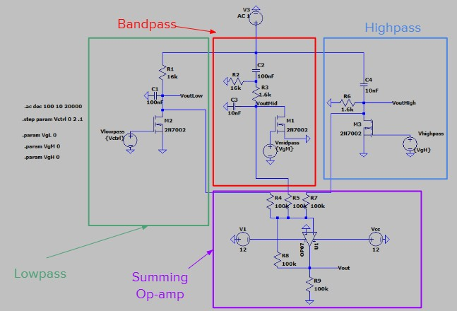

Microelectronics is imperative to society in various ways. Reponsible for essential data functioning and the existence of modern devices, this final project in UH Manoa's ECE 326: Microelectronics II course curriculum encapsulates all that the student has learned in both prior and current course to exhibit a device or system that is important to thriving communities today. To begin, students form groups or work independently to discuss and choose a relevant need/commodity. Following this, students were tasked in investigating their chosen topic and establishing a motivation for pursuing the application. Lastly, students are challenged with implementing their topic, developing an engineering-based analysis, and sharing their findings to the class via techinal presentation and IEEE report.

For this final project, I was responsible for assembling the presentations that were shared in class, proposing circuit schematic implementations to help with debugging and sanity checks, as well as writing the abstract and conclusion for the written IEEE report. I began by first discussing with my group our goals in designing an equalizer. Our varying backgrounds living in the state of Hawai'i were all interconnectted solely by our inspiration, preference, and vulnerability for the sound system displays of Hawai'i. I developed and assembled presentations to our topic by going into depth with the relevance equalizers held in car audio systems; introducing the specifics to why audio systems sound the way they do and how they are fine tuned to reach focused specifications. When our group was finished with our initial design schematics, I took initiative in plugging values into the circuit and making measurements that aligned realistically with those concepts learned in class. After sharing all of our findings with our peers, I helped summarize, reinstate, and finalize the written report we developed in accordance to our final product. By the end of this project, I noticed my foundation in microelectronics helped me better understand the tendencies and physical capabilities of equalizers. That is to say, I developed a stronger familiarity with how equalizers behave the way they do and the possibilites to why they could stop functioning.

If you are interested in learning more about this project, our written report can be found [here](https://docs.google.com/document/d/1sgpkPRnQSQnF0SSexefx18nQnNjKp4HZeSLet5IbBq0/edit?usp=sharing).

Below is a snippet of the schematic we developed for this project:

  

