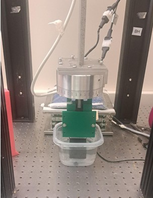
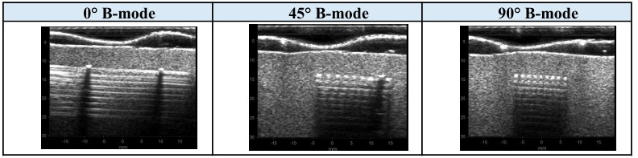

In my ECE 496 Senior Capstone Design, my partner and I had a project involving the development of a low-cost anisotropic phantom for use in ultrasound elastography. A phantom is an artificial substance that can emulate living tissue when being imaged thus, its primary purpose is to provide a platform for testing imaging technologies without resorting to living specimens. Our project focused on skeletal muscle because, muscle fibers are directionally organized, meaning their mechanical response can change depending on the angle at which they are scanned or tested.

The goal of this project was to create a low-cost phantom that could reproduce part of this direction-dependent behavior. To do this, we designed muscle-like fiber structures, fabricated them using resin 3D printing, embedded them into a gelatin/agar and graphite matrix, and scanned the final sample using ultrasound. The resin fibers were not meant to perfectly replicate real bicep tissue but, they gave the phantom an internal fiber direction, which is necessary for anisotropic behavior. If there were changes in the ultrasound output depending on the angle of scanning, this could be used as a basis for further experiments on ultrasound elastography.

For my part in the design process, I was responsible for the following parts of the project: helping solidify the project objective, researching previous phantom designs, designing and revising the mold and fiber approach, preparing the phantom material, assisting with ultrasound scanning, and helping analyze the resulting B-mode and MARDI displacement data. Our process involved Onshape for CAD modeling, resin printing for the detailed muscle-like fibers, filament printing for reusable mold boxes, MATLAB for ultrasound data processing, and Google Sheets for organizing displacement values and scatterplots.

Without a doubt, the most important aspect of this whole project is how the accuracy of fabrication affects the accuracy of the images. The presence of air bubbles, gaps, misalignment of the fiber, or even breakage of the resin strands can alter the results of the ultrasonic imaging process. Therefore, apart from being accurate, this particular project was about creating a procedure that could generate reproducible results through imaging.

Our final results showed that the phantom could be imaged at different orientations. B-mode ultrasound images were focused at 0°, 45°, and 90°, showing that the visible fiber pattern changed based on scan orientation. We also used MARDI-related displacement maps at frequencies such as 100 Hz, 500 Hz, and 1000 Hz to observe how the phantom response changed with excitation frequency. Nevertheless, these results demonstrated the viability of our project even though there is a need for further development for this project to become a quantitative validation tool for stiffness.

After completing this project, I have learned more about how electrical engineering theories relate to biomedical imaging research. Through this project, concepts of signal and system, ultrasound waves, MATLAB image processing, instrumentation, CAD model creation, 3D printing, and other engineering aspects were brought together. Additionally, I learned that engineering experimentation involved iterations since designs work theoretically, however, other aspects such as manufacturing capabilities, material property, alignment, and set-up could affect outcomes. Overall, this project allowed me to gain insight into biomedical imaging research as well as engineering design and fabrication processes at a capstone level research project.

For additional information regarding the project, please refer to the [Final Report](https://drive.google.com/file/d/1F8LuvqYocZyBhn9sI9Jryyc8esJsQDYH/view?usp=drive_link) where details such as phantom design, fabrication process, and imaging were elaborated on.

Below is a picture of the fabricated phantom and imaging setup:

  

Below is a sample of the B-mode ultrasound data collected at different scan orientations:

  

And here is an image of my partner [Mark](https://www.linkedin.com/in/mark-navarro-82b24332a/) and I with our professor [Dr. Hossain](https://www.uhcancercenter.org/hossain-murad) during UH Manoa's Spring 2026 ECE 496 Poster Session:

  

