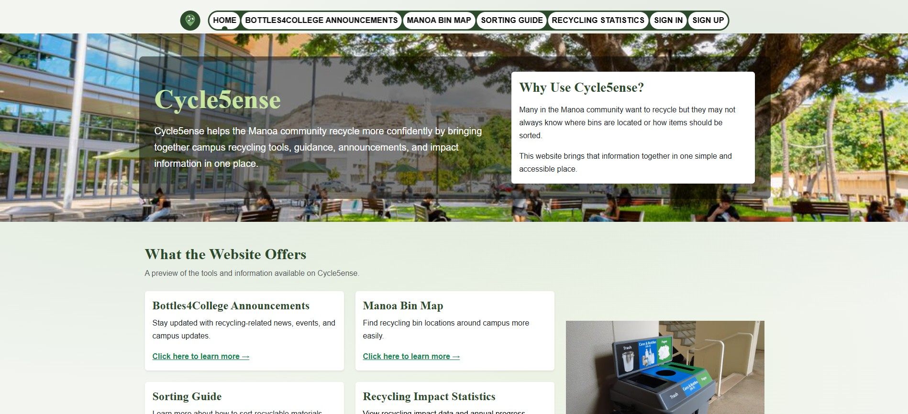
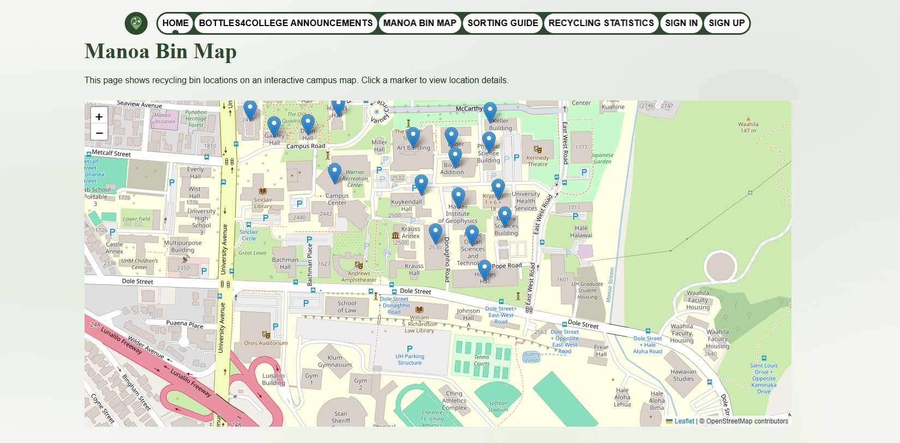

Cycle5ense is a web-based application developed as a final project for the course ICS 314: Software Engineering I offered by the University of Hawai’i at Mānoa. The current project will serve as an aid in increasing access to and knowledge about recycling among students on campus by providing a website that features information about recycling, the locations of the recycle bins, recycling tips, and news about recycling activities on campus. It is also one of the objectives of our group when developing this application to help individuals who want to recycle but, lack information about it.

To begin, our group discussed common problems related to recycling on campus and used those concerns to shape the purpose of the application. This way, we started planning the essential features for Cycle5ense such as the home page, recycling resources, mapping capabilities, user authentication, and admin functionality. The application development was done on a TypeScript-based Next.js framework architecture with database integration and deployment through Vercel. The public GitHub organization contains both the main Cycle5ense repository and the project documentation page while the main application repository links to the deployed website.

Regarding the project, the involvement in its development was related to developing the front-end structure, designing pages, debugging, and application development in general. Concerning the development of the interface, I should say that it involved refining some elements so as to make the interface well-structured and convenient for users. In addition, I helped with debugging and solving certain issues connected with the navigation bar, landing page functionality, mockup of recycling statistics, footer design, route setup of the admin page, and recycling dates display. As regards to the collaboration with my colleagues, not only did I code yet I also managed our project using certain features of GitHub including issues, branches, and others.

Among some of the lessons learned from the completion of this project were the value of planning and coordination in creating a full-stack app in a team environment. While smaller projects involve independent coding for the most part, Cycle5ense involved coordinating several parts of the project including the front end, database models, authentication, authorization by role, deployment, and documentation of the project. Additionally, this project helped me gain further experience with technologies like Next.js, React-Bootstrap, Prisma, PostgreSQL, GitHub, and Vercel as a fully functioning and deployed website.

From the completion of this project, I got a better understanding of software engineering not only about coding particular methods or pages but also about being able to collaborate with others on a shared codebase, communicating through issues and pull requests, debugging other peoples' code, and creating features for real-life users. In short, Cycle5ense provided me with an opportunity to practice developing software in a collaborative environment and design software toward a real-world application on our university’s campus.

If you are interested in learning more about this project, our organization GitHub page can be found [here](https://github.com/cycle5ense), our project documentation page [here](https://cycle5ense.github.io/), and the deployed application [here](https://cycle5ense.vercel.app/).

Below is a snippet of the Cycle5ense website homepage:

Here is another snippet of the Cycle5ense website showing our focus on the map API implementation:
