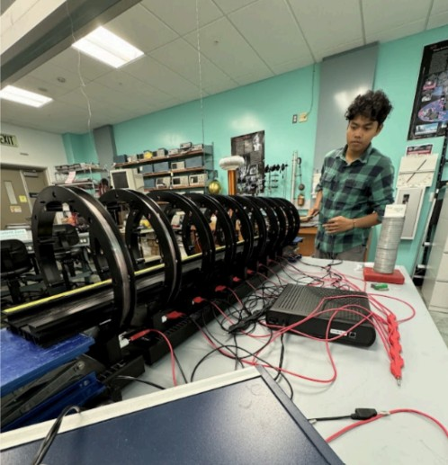

In PHYS 274: General Physics II, the concept of magnetic fields were relevant to the entire curriculum so understanding its behavior to a considerable extent was nonnegotiable. The “Harmonizing Magnetic Fields in Arrays of Current-Carrying Helmholtz Coils” research project I took part in analyzed the properties of uniform magnetic fields through the arrangement of Helmholtz coils. This study involved theoretical analysis, quantitative analysis, and direct physical trials to investigate the characteristics and possible applications of uniform magnetic field creations. In this experimentation, we set a boundary in basing our measurments strictly through 10 coils, a PASCO Capstone system, theoretical computations and expectations for verifcation, and two wiring configurations. In essence, a large amount of time was put into understanding the behavior and tendencies of magnetics to fulfill this research project.

As far as contributions go, I was responsible for this entire project apart from supervision by my physics professor at the time Dr. Rai Buddhi. Before I could start any physical analysis, I made it a priority to understand the behavior of magnetic fields; more importantly, I made time outside of class to research the particular Helmholtz coils we used to conduct the experiment. In doing so, I created a equations sheet exhibiting the effects of magnetic field strength based on the addition of coils over a set distance. After understanding this fundamentally, I applied my experiences in schematics to assemble the Helmholtz coils on rails in accordance to the discussed boundaries. Later, I would conduct tests to graph results of the differing wiring configurations and compare its effects to both the theoretical results and analysis conducted prior. In the end, although the physical simulation did not perfectly represent the theoretical ideas, the concepts were still at full display and aligned with what our assumptions. 

Albeit this experience was very foundational based on prior knowledge, I believe this project taught me a lot. For one, I was in the process of beginning to learn about magnetic fields when I initially started this project so I was very prone to mistakes. I feel as if I learned a lot more about magnetic fields as a result of this project as opposed to learning strictly through lectures. What made this project more entertaining and enticing has to be the fact that I got to implement my skills as an engineering student to develop the work environment. As a whole, working on this project and exhibiting my skills simultaneously helped me stay grounded in relation to my foundation for both fields of study.

If you are interested in learning more about this project, my published report and findings can be found in my professor's website in the 'Student Research' tab under the timeline 'Spring 2024' in this link [here](https://www2.hawaii.edu/~buddhir/).

Below is a picture my professor took of me running a physical simulation for this project with the coils in parallel orientation:

  

